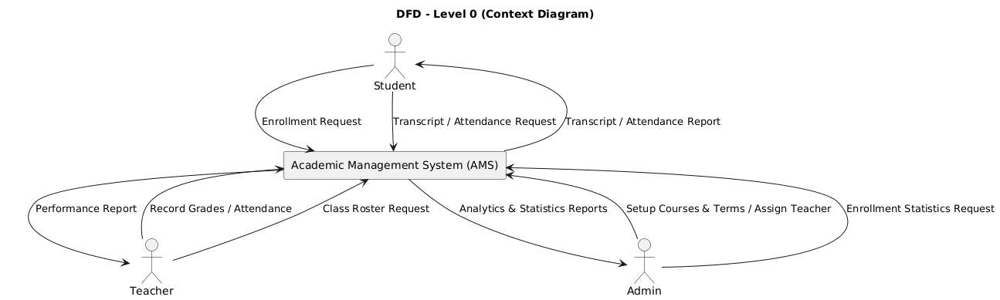
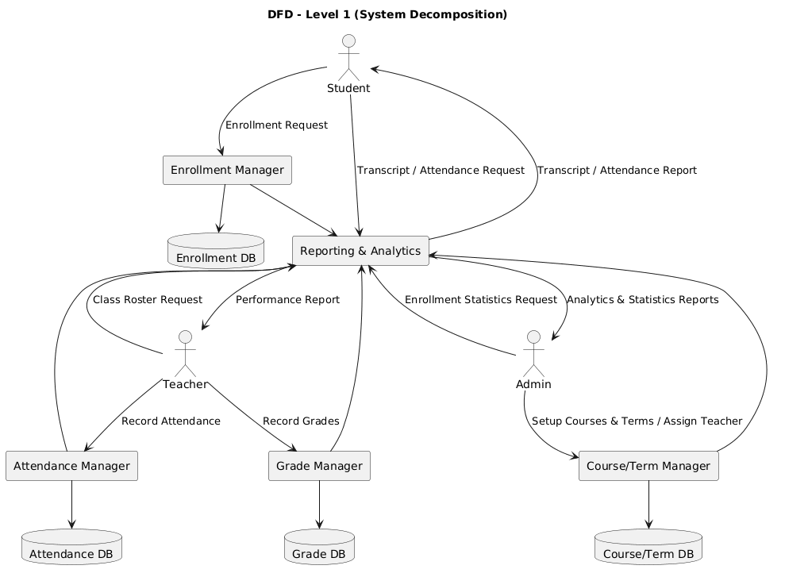

# Data Flow Diagram (DFD) - Academic Management System

This document describes the Data Flow Diagrams (DFD) for the Academic Management System (AMS).  
The DFDs illustrate how data moves between external entities, system processes, and data stores.

---

## Level 0: Context Diagram

The Level 0 DFD shows the AMS as a single process (black box) and its interactions with external entities.

**External Entities and Flows**:
- **Student**
  - Sends: Enrollment Request, Transcript/Attendance Request
  - Receives: Transcript, Attendance Report
- **Teacher**
  - Sends: Record Grades, Record Attendance, Class Roster Request
  - Receives: Performance Report
- **Admin**
  - Sends: Setup Courses & Terms, Assign Teacher, Enrollment Statistics Request
  - Receives: Analytics & Statistics Reports

---

## Level 1: System Decomposition

The Level 1 DFD decomposes AMS into major subsystems (Managers) and data stores.

**Processes**:
- **Enrollment Manager**
  - Handles student enrollment requests
  - Stores data in **Enrollment DB**
- **Grade Manager**
  - Handles teacher grade submissions
  - Stores data in **Grade DB**
- **Attendance Manager**
  - Handles teacher attendance submissions
  - Stores data in **Attendance DB**
- **Course/Term Manager**
  - Handles admin setup of courses, terms, and teacher assignments
  - Stores data in **Course/Term DB**
- **Reporting & Analytics**
  - Collects data from all DBs
  - Responds to queries from Student, Teacher, and Admin with customized reports

**Data Stores**:
- **Course/Term DB** → Course and term configurations
- **Enrollment DB** → Student course enrollment records
- **Grade DB** → Student grades and GPA values
- **Attendance DB** → Student attendance records

**External Entities**:
- **Student**: Requests enrollment, transcript, attendance
- **Teacher**: Records grades, attendance; requests class rosters
- **Admin**: Sets up courses/terms, assigns teachers, requests statistics

---

## Summary

- **Level 0** illustrates AMS as a whole and its interactions with external users.  
- **Level 1** decomposes the system into five key processes with supporting data stores.  
- The design ensures all core functions (enrollment, grading, attendance, course management, and reporting) are represented, while keeping data flows clear and complete.