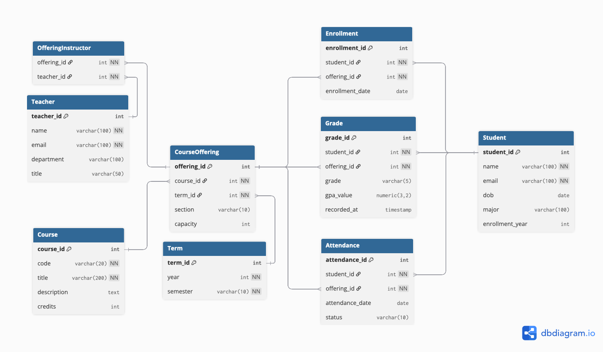

# Entity Relationship Diagram (ERD) - Academic Management System

This document explains the **Entity Relationship Diagram (ERD)** for the Academic Management System (AMS).  
The ERD shows the database schema, including **entities (tables)**, **attributes (columns)**, and **relationships (foreign keys)**.

---

## ERD Diagram

---

## Key Entities and Relationships

### 1. Student
- Attributes: `student_id`, `name`, `email`, `dob`, `major`, `enrollment_year`
- Represents students enrolled in the institution.
- Relationships:
  - One student → many enrollments
  - One student → many attendance records
  - One student → many grades (through enrollment)

---

### 2. Teacher
- Attributes: `teacher_id`, `name`, `email`, `department`, `title`
- Represents instructors in the system.
- Relationships:
  - One teacher → many course offerings (via OfferingInstructor)

---

### 3. Admin
- (Logical role, not stored as a separate table in ERD; handled via system roles/permissions.)

---

### 4. Term
- Attributes: `term_id`, `year`, `semester`
- Represents academic terms (e.g., 2025 Spring).
- Relationships:
  - One term → many course offerings

---

### 5. Course
- Attributes: `course_id`, `code`, `title`, `description`, `credits`
- Represents course definitions (catalog).
- Relationships:
  - One course → many course offerings

---

### 6. CourseOffering
- Attributes: `offering_id`, `section`, `capacity`
- Represents a specific offering of a course in a term, assigned to a teacher.
- Relationships:
  - Many course offerings → one course
  - Many course offerings → one term
  - Many course offerings → one teacher

---

### 7. Enrollment
- Attributes: `enrollment_id`, `enrollment_date`
- Represents a student’s registration in a specific course offering.
- Relationships:
  - Many enrollments → one student
  - Many enrollments → one course offering
  - One enrollment → one grade
  - One enrollment → many attendance records

---

### 8. Grade
- Attributes: `grade_id`, `grade`, `gpa_value`, `recorded_at`
- Represents grades for an enrollment.
- Relationships:
  - One grade → belongs to one enrollment

---

### 9. Attendance
- Attributes: `attendance_id`, `date`, `status`
- Represents attendance records for students in a course offering.
- Relationships:
  - Many attendance records → one enrollment

---

## Summary
- **Student, Teacher, Admin** → represent system users
- **Term, Course, CourseOffering** → represent academic structure
- **Enrollment, Grade, Attendance** → represent academic records
- The ERD ensures **normalization**, avoids redundancy, and supports analytics and reporting through clear relational links.