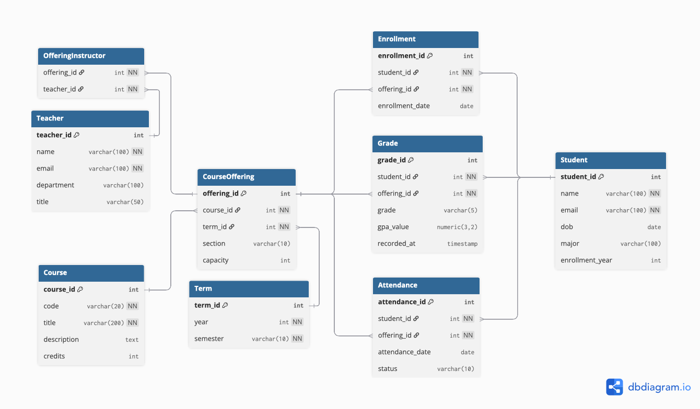
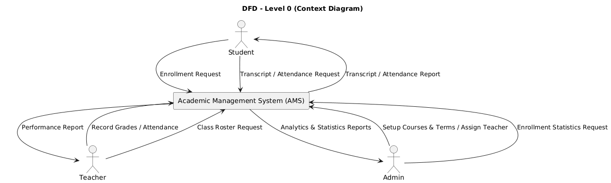
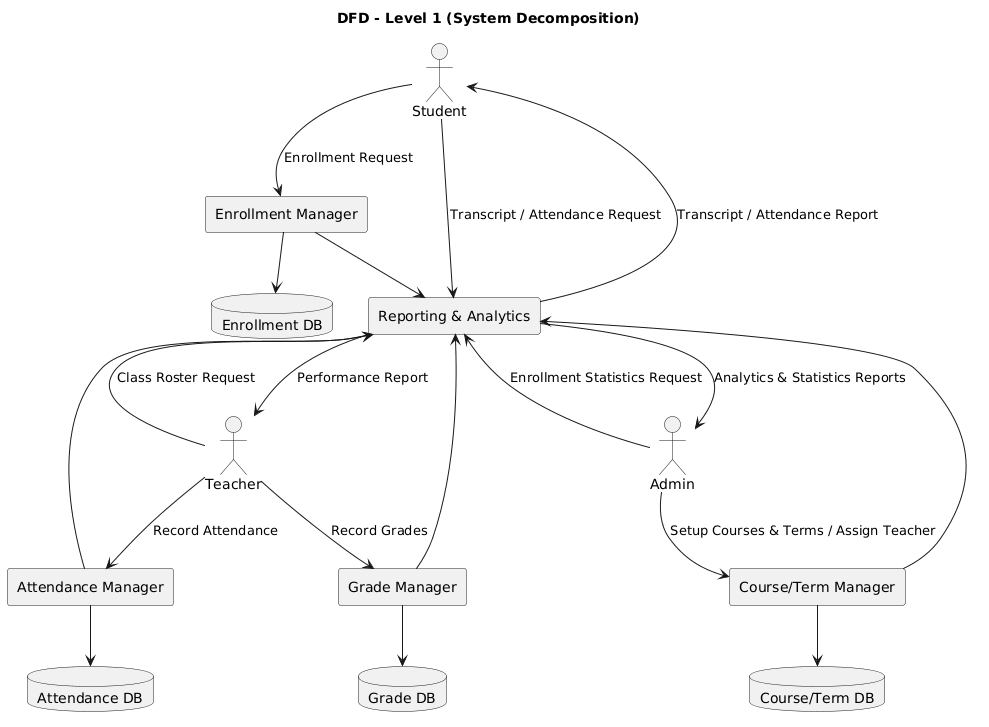
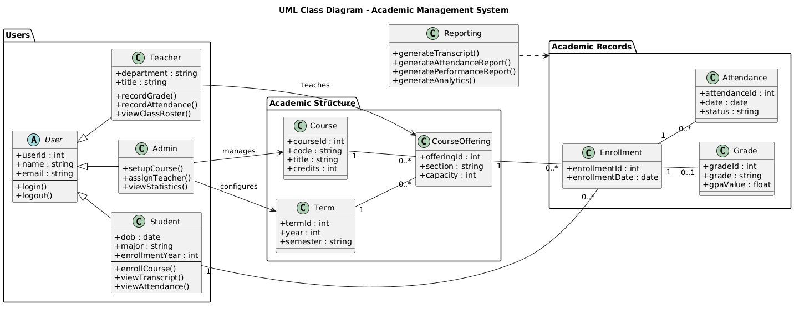

# Academic Management System - Design Documentation

This document integrates all design artifacts of the **Academic Management System (AMS)**.  
It includes:  
- **Software Requirements Specification (SRS)**  
- **Data Dictionary**  
- **Entity-Relationship Diagram (ERD)**  
- **Data Flow Diagram (DFD)**  
- **UML Class Diagram**  

The goal is to provide a comprehensive view of AMS, from requirements to design.

---

## 1. Software Requirements Specification (SRS)

### 1.1 Purpose
The Academic Management System (AMS) aims to support student enrollment, course and term management, grade recording, attendance tracking, and reporting.  
It is designed for three primary user groups: **Students**, **Teachers**, and **Administrators**.

### 1.2 Scope
- **Students**: enroll in courses, view transcripts, check attendance.  
- **Teachers**: manage course offerings, record grades, record attendance.  
- **Administrators**: configure terms, create courses, assign teachers, generate reports.  

### 1.3 Functional Requirements
- Student course enrollment  
- Teacher grade and attendance submission  
- Administrator management of courses and terms  
- Reporting and analytics for all roles  

### 1.4 Non-Functional Requirements
- **Performance**: support at least 500 concurrent users  
- **Security**: role-based access control  
- **Scalability**: compatible with PostgreSQL and AWS RDS deployment  
- **Reliability**: daily backups, recovery support  

### 1.5 Use Cases

| Use Case ID | Actor      | Description                                    | Preconditions                  | Postconditions                      | DFD Mapping               | UML Mapping                    |
|-------------|-----------|------------------------------------------------|--------------------------------|--------------------------------------|---------------------------|--------------------------------|
| UC-01       | Student   | Enroll in a course                             | Student is logged in           | Enrollment record created            | Enrollment Manager        | Student.enrollCourse()         |
| UC-02       | Student   | View transcript                                | Student has completed courses  | Transcript report displayed          | Reporting & Analytics     | Student.viewTranscript() / Reporting.generateTranscript() |
| UC-03       | Student   | View attendance                                | Attendance records exist       | Attendance report displayed          | Reporting & Analytics     | Student.viewAttendance() / Reporting.generateAttendanceReport() |
| UC-04       | Teacher   | Record grades for a course offering            | Teacher assigned to offering   | Grades saved to Grade DB             | Grade Manager             | Teacher.recordGrade()          |
| UC-05       | Teacher   | Record attendance for a course offering        | Teacher assigned to offering   | Attendance saved to Attendance DB    | Attendance Manager        | Teacher.recordAttendance()     |
| UC-06       | Teacher   | View class roster                             | Teacher assigned to offering   | Student list displayed               | Enrollment Manager        | Teacher.viewClassRoster()      |
| UC-07       | Admin     | Setup academic term and course offerings       | Admin privileges granted       | Term and course offerings created    | Course/Term Manager       | Admin.setupCourse()            |
| UC-08       | Admin     | Assign teacher to a course offering            | Teacher exists in system       | Teacher assigned to offering         | Course/Term Manager       | Admin.assignTeacher()          |
| UC-09       | Admin     | View system-wide statistics and analytics      | Admin privileges granted       | Reports generated by Reporting module| Reporting & Analytics     | Admin.viewStatistics() / Reporting.generateAnalytics() |
| UC-10       | Reporting | Generate transcript, attendance, performance   | Relevant data stored in DBs    | Reports generated and displayed      | Reporting & Analytics     | Reporting.generateTranscript(), generateAttendanceReport(), generatePerformanceReport(), generateAnalytics() |
---

## 2. Data Dictionary

### 2.1 Student
| Attribute        | Type          | Description                  |
|------------------|--------------|------------------------------|
| student_id (PK)  | int          | Unique ID for student        |
| name             | varchar(100) | Full name                    |
| email            | varchar(100) | Unique email address         |
| dob              | date         | Date of birth                |
| major            | varchar(100) | Major field of study         |
| enrollment_year  | int          | Year of enrollment           |

---

### 2.2 Teacher
| Attribute        | Type          | Description                  |
|------------------|--------------|------------------------------|
| teacher_id (PK)  | int          | Unique ID for teacher        |
| name             | varchar(100) | Full name                    |
| email            | varchar(100) | Email                        |
| department       | varchar(100) | Department                   |
| title            | varchar(50)  | Academic title               |

---

### 2.3 Term
| Attribute        | Type          | Description                  |
|------------------|--------------|------------------------------|
| term_id (PK)     | int          | Unique ID for term           |
| year             | int          | Academic year                |
| semester         | varchar(20)  | Semester (e.g. Spring, Fall) |

---

### 2.4 Course
| Attribute        | Type          | Description                  |
|------------------|--------------|------------------------------|
| course_id (PK)   | int          | Unique ID for course         |
| code             | varchar(20)  | Course code (e.g. CS101)     |
| title            | varchar(100) | Course title                 |
| credits          | int          | Credit value                 |

---

### 2.5 CourseOffering
| Attribute        | Type          | Description                  |
|------------------|--------------|------------------------------|
| offering_id (PK) | int          | Unique ID for offering       |
| section          | varchar(10)  | Section label (e.g. A, B)    |
| capacity         | int          | Maximum number of students   |
| term_id (FK)     | int          | Linked academic term         |
| course_id (FK)   | int          | Linked course                |

---

### 2.6 OfferingInstructor
| Attribute          | Type          | Description                  |
|--------------------|--------------|------------------------------|
| offering_instructor_id (PK) | int | Unique ID for assignment     |
| offering_id (FK)   | int          | Linked course offering       |
| teacher_id (FK)    | int          | Linked teacher               |

*This table manages the many-to-many relationship between CourseOffering and Teacher.*

---

### 2.7 Enrollment
| Attribute        | Type          | Description                  |
|------------------|--------------|------------------------------|
| enrollment_id (PK)| int         | Unique ID for enrollment     |
| student_id (FK)  | int          | Linked student               |
| offering_id (FK) | int          | Linked course offering       |
| enrollment_date  | date         | Date of enrollment           |

---

### 2.8 Grade
| Attribute        | Type          | Description                  |
|------------------|--------------|------------------------------|
| grade_id (PK)    | int          | Unique ID for grade          |
| enrollment_id (FK)| int         | Linked enrollment            |
| grade            | varchar(5)   | Grade value (e.g. A, B, C)   |
| gpa_value        | float        | GPA equivalent               |
| recorded_at      | timestamp    | Date/time grade recorded     |

---

### 2.9 Attendance
| Attribute         | Type          | Description                  |
|-------------------|--------------|------------------------------|
| attendance_id (PK)| int          | Unique ID for attendance     |
| enrollment_id (FK)| int          | Linked enrollment            |
| date              | date         | Attendance date              |
| status            | varchar(10)  | Attendance status (Present/Absent) |
---

## 3. Entity-Relationship Diagram (ERD)

### ERD Diagram

### Explanation
- **Student ↔ Enrollment ↔ CourseOffering** → core link of student course registration  
- **Enrollment ↔ Grade** → one grade per enrollment  
- **Enrollment ↔ Attendance** → multiple attendance records per enrollment  
- **Course ↔ CourseOffering ↔ Term** → courses offered within academic terms  
- **Teacher ↔ CourseOffering** → teachers assigned to course offerings  

---

## 4. Data Flow Diagram (DFD)

### Level 0: Context Diagram

- **Student**: sends enrollment/record requests, receives transcripts and attendance  
- **Teacher**: records grades/attendance, receives reports  
- **Admin**: sets up courses/terms, receives analytics  

### Level 1: System Decomposition

- **Enrollment Manager** → handles student enrollments  
- **Grade Manager** → handles grade submissions  
- **Attendance Manager** → records attendance  
- **Course/Term Manager** → admin course setup and teacher assignments  
- **Reporting & Analytics** → generates reports for all roles  

---

## 5. UML Class Diagram

### UML Diagram

### Explanation
- **User (abstract)** → base class for Student, Teacher, Admin  
- **Student** → can enroll in courses, view transcripts, view attendance  
- **Teacher** → can record grades, record attendance, view class rosters  
- **Admin** → can setup courses, assign teachers, view statistics  
- **Course / Term / CourseOffering** → academic structure  
- **Enrollment / Grade / Attendance** → academic records  
- **Reporting** → generates transcripts, attendance reports, performance reports, analytics  

---

## 6. Summary

- **SRS** defines the system’s purpose, scope, and requirements.  
- **Data Dictionary + ERD** define the **database schema**.  
- **DFD** defines **data flow and process logic**.  
- **UML** defines **system classes, methods, and relationships**.  

Together, these artifacts provide a **complete design specification** for the Academic Management System.