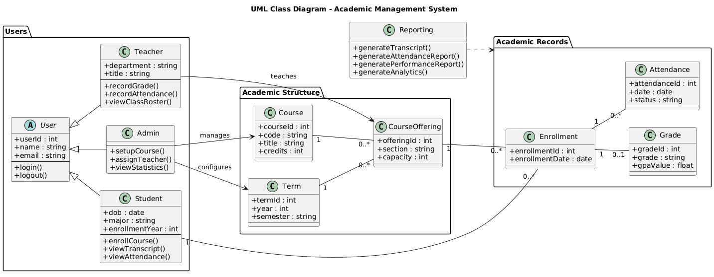

# UML Class Diagram - Academic Management System

This document explains the UML Class Diagram for the **Academic Management System (AMS)**.  
The class diagram shows the main entities (classes), their attributes and methods, and how they are related.  
It complements the **ER Diagram** (data structure) and the **DFD** (data flows) by showing **who performs what operations** in the system.

---

## UML Class Diagram

---

## Key Packages and Classes

### 1. Users
- **User (abstract class)**  
  - Common attributes: `userId`, `name`, `email`  
  - Common methods: `login()`, `logout()`  
- **Student** (inherits from User)  
  - Attributes: `dob`, `major`, `enrollmentYear`  
  - Methods: `enrollCourse()`, `viewTranscript()`, `viewAttendance()`  
- **Teacher** (inherits from User)  
  - Attributes: `department`, `title`  
  - Methods: `recordGrade()`, `recordAttendance()`, `viewClassRoster()`  
- **Admin** (inherits from User)  
  - Methods: `setupCourse()`, `assignTeacher()`, `viewStatistics()`  

---

### 2. Academic Structure
- **Term**  
  - Represents academic term (year + semester).  
- **Course**  
  - Represents course definition (code, title, credits).  
- **CourseOffering**  
  - Represents an actual offering of a course in a term.  
  - Connected to `Course` and `Term`.  
- **Associations**  
  - Admin → manages Course, configures Term  
  - Teacher → teaches CourseOffering  

---

### 3. Academic Records
- **Enrollment**  
  - Links `Student` to `CourseOffering`  
  - Attributes: `enrollmentId`, `enrollmentDate`  
- **Grade**  
  - Linked to Enrollment (one enrollment → one grade)  
- **Attendance**  
  - Linked to Enrollment (one enrollment → many attendance records)  

---

### 4. Reporting
- Independent class responsible for analytics and reporting.  
- Methods:  
  - `generateTranscript()`  
  - `generateAttendanceReport()`  
  - `generatePerformanceReport()`  
  - `generateAnalytics()`  
- Depends on Academic Records (Enrollment, Grade, Attendance, CourseOffering).  

---

## Summary
- **Users package** shows three roles (Student, Teacher, Admin) with shared behavior from `User`.  
- **Academic Structure package** organizes courses, terms, and offerings.  
- **Academic Records package** captures enrollment, grades, and attendance.  
- **Reporting** provides analytics and reports by aggregating data.  

Together, this UML class diagram connects **data (ERD)** and **processes (DFD)** into a coherent system view, highlighting both **entities** and **their behaviors**.